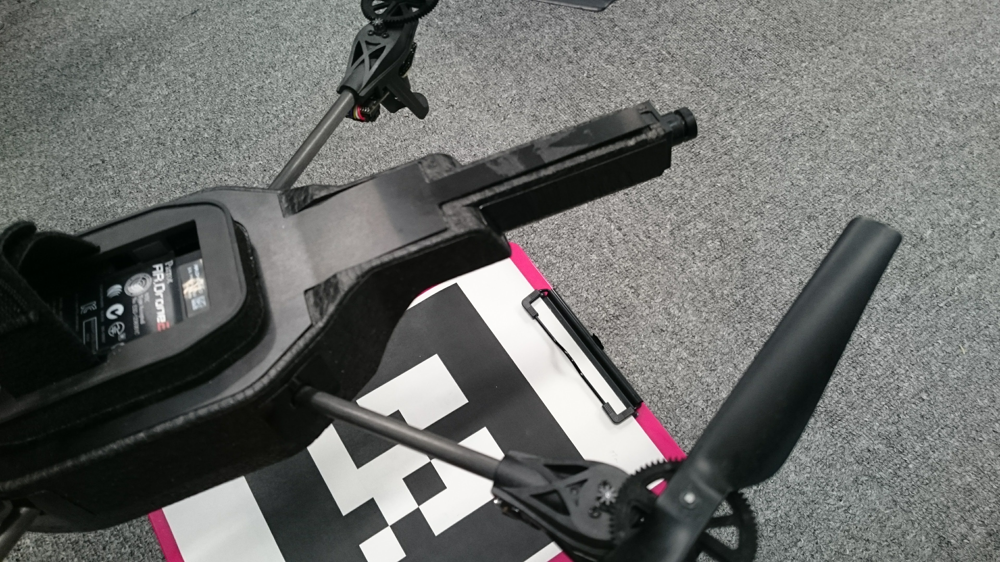
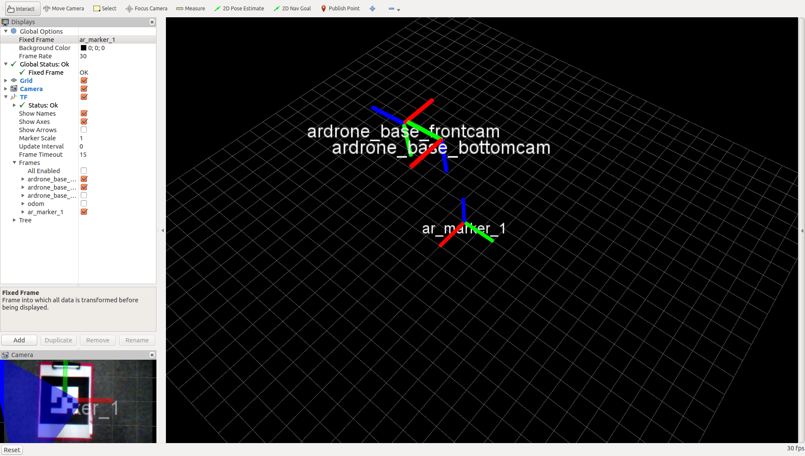
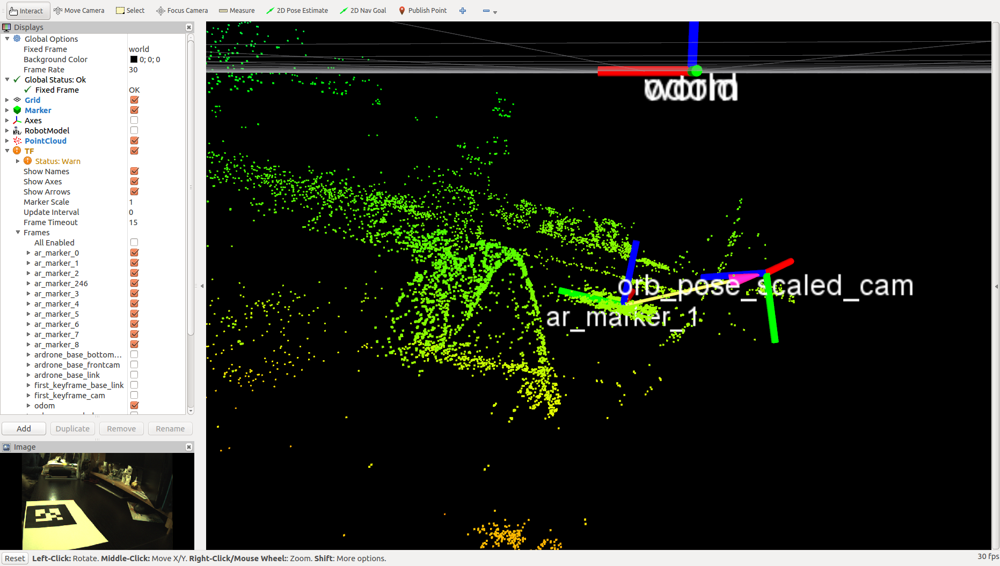

# ar_tracking

AR.droneのカメラより，arマーカをPID制御で追跡するためのリポジトリ．



## Prepare

### [ar_drone driver](https://github.com/lancer-evolution/ardrone)

```bash
git clone git@github.com:lancer-evolution/ardrone.git
cd ~/catkin_ws
rosdep install -i --from-paths src
catkin_make
```

### [ar_track_alvar](http://wiki.ros.org/ar_track_alvar)

```bash
sudo apt-get install ros-indigo-ar-track-alvar
```

ARマーカの準備(2種類)
* dataフォルダの中にある[MarkerData_1.png](data/MarkerData_1.png)を印刷する．idは1
* generatorを使って任意のマーカを生成する．
```bash
rosrun ar_track_alvar createMarker -s 20.0 -p
```
`-s`オプションはサイズ(cm)を決める．

### [ps3joy](http://wiki.ros.org/ps3joy)

```bash
sudo apt-get install ros-indigo-joystick-drivers
```

## Usage

### ar_pid

AR.drone driver
```bash
roslaunch ardrone_autonomy my_driver.launch
```

ar tracking

カメラは`bottom_cam`にしておく

```bash
roslaunch ar_tracking ar_track.launch
rviz -d $(rospack find ar_tracking)/data/rviz_config.rviz

roslaunch ar_tracking ar_pid.launch
```



### orb_scale_estimator

```bash
roslaunch ar_tracking orb_scale_estimator.launch
```



## Details

### ar_track.launch

arマーカを認識するためのローンチファイル．  
重要なパラメータは`maker_size`．印刷マーカを定規で測る(cm)．  
カメラのキャリブレーション情報はardroneのドライバから取得するため，事前に`~/.ros/camera_info`などにカメラ情報を入れておく．

### ar_pid.launch

joyによるマニュアル操作`Manual Mode`とarマーカを追跡する`Tracking Mode`をL2により切り替える．  
ただし，`Tracking Mode`が実行できるのはarマーカを認識しているときのみで，認識できなければ自動で`Manual Mode`に切り替わる．

### orb_scale_estimator.launch

[https://github.com/lancer-evolution/ardrone_testbed](https://github.com/lancer-evolution/ardrone_testbed)
にある、ORB_SLAMのスケールを推定する．  
`orb_slam`と`ar_track_alvar`を事前に起動しておく必要がある．  
スケールの推定には、orbとar_trackerの移動量から線形的に求めている．また，収束判定には変動係数を用いることで，orbのスケール不変性に対処している．


